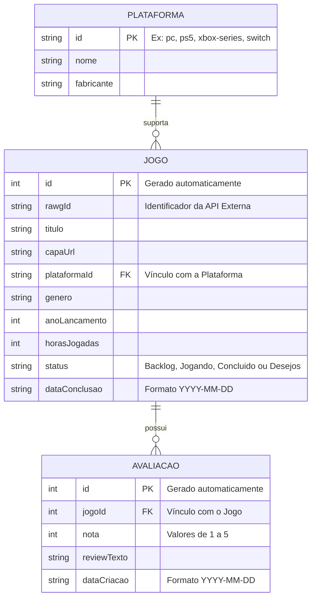

```markdown
# 🛠️ Especificação Técnica (Tech Spec) - Backlog Log

Este documento detalha o modelo de dados, os relacionamentos entre as entidades e a estrutura prevista para a API Fake e integrações do sistema **Backlog Log**.

## 1. Modelo de Dados (Diagrama ER)

Abaixo está o Diagrama Entidade-Relacionamento (DER) que representa a estrutura prevista para o `db.json` e como as informações do sistema se relacionam.



## 2. Dicionário de Dados

Breve explicação das entidades principais:

* **Jogos:** Responsável por armazenar as informações do catálogo pessoal e progresso dos títulos.
* `id`: Identificador único gerado pelo JSON Server.
* `rawgId`: ID de referência do jogo na API pública RAWG (para sincronização de metadados).
* `titulo`: Nome do jogo de video game.
* `capaUrl`: URL da imagem da capa (otimizada em formato WebP).
* `plataformaId`: Chave estrangeira que conecta o jogo a uma plataforma específica.
* `genero`: Gênero principal do jogo (ex.: Ação, RPG, Estratégia).
* `anoLancamento`: Ano em que o jogo foi lançado.
* `horasJogadas`: Quantidade acumulada de horas dedicadas ao título.
* `status`: Situação atual do jogo na biblioteca. Aceita os valores **Backlog**, **Jogando**, **Concluido** ou **Desejos**.
* `dataConclusao`: Data em que o jogo foi zerado (obrigatório apenas se o status for *Concluido*).


* **Avaliações:** Armazena as notas e análises pessoais escritas pelo jogador.
* `id`: Identificador único gerado pelo JSON Server.
* `jogoId`: Chave estrangeira que vincula a avaliação a um jogo da biblioteca.
* `nota`: Nota atribuída pelo usuário variando de **1** a **5**.
* `reviewTexto`: Análise textual crítica do jogo enviada pelo formulário.
* `dataCriacao`: Data de registro da avaliação no sistema.


* **Plataformas:** Armazena as opções de consoles e ecossistemas disponíveis no sistema.
* `id`: Identificador único da plataforma.
* `nome`: Nome de exibição da plataforma (ex.: PlayStation 5, PC).
* `fabricante`: Empresa responsável pela plataforma (ex.: Sony, Microsoft, Nintendo).


Cada jogo cadastrado no sistema deverá possuir uma **Plataforma** associada e poderá conter uma **Avaliação** vinculada caso tenha sido finalizado.

## 3. Rotas da API (JSON Server)

A aplicação utilizará uma API local simulada pelo JSON Server para persistir e consultar os dados.

Principais endpoints previstos:

* `GET /jogos` - Retorna a lista completa de jogos do backlog.
* `POST /jogos` - Cadastra um novo jogo na biblioteca.
* `GET /jogos/:id` - Retorna os detalhes de um jogo específico.
* `PATCH /jogos/:id` - Atualiza dados pontuais do jogo (ex.: status ou horas jogadas).
* `DELETE /jogos/:id` - Remove um jogo da coleção.
* `GET /avaliacoes?jogoId=1` - Retorna a avaliação e review associada a um jogo.
* `POST /avaliacoes` - Cadastra uma nova avaliação/review para um jogo zerado.
* `GET /plataformas` - Retorna a lista de plataformas cadastradas para popular campos `<select>`.

## 4. Estrutura do Banco de Dados (db.json)

Esta é uma representação inicial da estrutura do banco de dados simulado que será utilizada pelo JSON Server.

```json
{
  "jogos": [
    {
      "id": "1",
      "rawgId": "3498",
      "titulo": "Grand Theft Auto V",
      "capaUrl": "[https://media.rawg.io/media/games/20a/20aa7858b9221d1163b7f42d77265c1b.jpg](https://media.rawg.io/media/games/20a/20aa7858b9221d1163b7f42d77265c1b.jpg)",
      "plataformaId": "ps5",
      "genero": "Ação / Mundo Aberto",
      "anoLancamento": 2013,
      "horasJogadas": 85,
      "status": "Concluido",
      "dataConclusao": "2026-08-20"
    },
    {
      "id": "2",
      "rawgId": "58175",
      "titulo": "God of War Ragnarök",
      "capaUrl": "[https://media.rawg.io/media/games/362/36203f39a039d919d3f1188185c6f376.jpg](https://media.rawg.io/media/games/362/36203f39a039d919d3f1188185c6f376.jpg)",
      "plataformaId": "ps5",
      "genero": "Ação / Aventura",
      "anoLancamento": 2022,
      "horasJogadas": 12,
      "status": "Jogando",
      "dataConclusao": ""
    }
  ],
  "avaliacoes": [
    {
      "id": "1",
      "jogoId": "1",
      "nota": 5,
      "reviewTexto": "Uma obra-prima do mundo aberto. A história intercala muito bem entre os 3 protagonistas.",
      "dataCriacao": "2026-08-20"
    }
  ],
  "plataformas": [
    {
      "id": "pc",
      "nome": "PC",
      "fabricante": "Microsoft / Valve"
    },
    {
      "id": "ps5",
      "nome": "PlayStation 5",
      "fabricante": "Sony"
    },
    {
      "id": "xbox-series",
      "nome": "Xbox Series X/S",
      "fabricante": "Microsoft"
    },
    {
      "id": "switch",
      "nome": "Nintendo Switch",
      "fabricante": "Nintendo"
    }
  ]
}

```

## 5. Tecnologias e Integrações

### Framework CSS

* **Tecnologia:** Bootstrap
* **Versão:** 5.3.3
* **Licença:** MIT
* **Uso:** Grid responsivo, Navbar, Cards de jogos, Buttons, Forms, Input Groups, Badges de status, Modais de cadastro e classes utilitárias.

A estilização padrão do Bootstrap será customizada com SCSS para reproduzir o Design System Dark Mode / Gamer definido nos protótipos do projeto.

### API Pública

* **Serviço:** RAWG Video Games Database API
* **Versionamento:** v1
* **Formato utilizado:** JSON
* **Endpoint:** `https://api.rawg.io/api/games?key={api_key}&search={nome_do_jogo}`
* **Método:** GET

Campos utilizados:

* `id` (mapeado como `rawgId`)
* `name`
* `background_image` (usado para autocompletar a `capaUrl`)
* `released` (extração do ano de lançamento)
* `genres` (mapeamento do gênero principal)

A consulta será realizada durante o preenchimento do formulário para autocompletar os dados técnicos do jogo digitado.

#### Erros previstos

* Chave de API inválida ou ausente (`401 Unauthorized`): o sistema deve cair para o modo manual de preenchimento.
* Termo de busca sem resultados (`results: []`): a aplicação deve alertar que o jogo não foi encontrado na base externa e permitir o preenchimento manual.
* Falha de conexão/Network Error: o sistema deverá exibir uma mensagem informativa ao usuário sem travar a interface.

```

```
